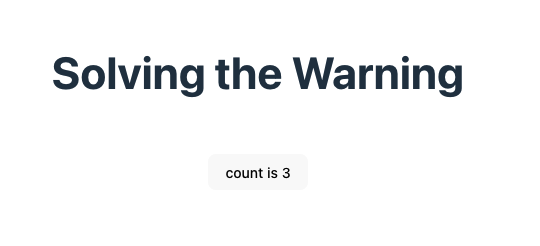
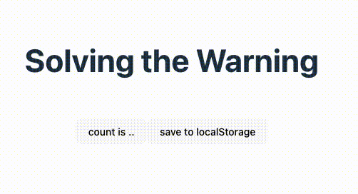

# Testing with React: solving the «should be wrapped into act(...)» error

## Starting point



```log

 PASS  src/my-component.test.tsx
  <MyComponent />
    ✓ renders a button with the text "count is 0" (69 ms)
    ✓ clicking the button increments the count (20 ms)

```

## `useEffect()`: reading from local storage



```log
  <MyComponent />
    ✓ renders a button with the text "count is .." (66 ms)
    ✕ clicking the button increments the count (25 ms)

  ● <MyComponent /> › clicking the button increments the count

    expect(received).toBe(expected) // Object.is equality

    Expected: "count is 1"
    Received: "count is .."
```
